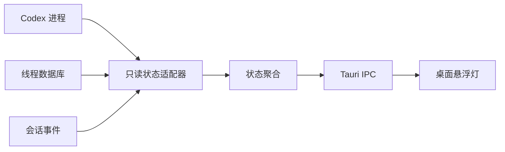

<div align="center">

# CodePulse

### 让 Codex 的工作状态，始终在桌面上清晰可见

轻量、安静、常驻桌面的 Windows Codex 状态指示灯。

[](https://github.com/EimJacky/CodePulse/releases/latest)
[](https://tauri.app/)
[](https://github.com/EimJacky/CodePulse/releases/latest)
[](https://github.com/EimJacky/CodePulse)

<br>


<br>

[**下载 Windows 最新版**](https://github.com/EimJacky/CodePulse/releases/latest/download/CodePulse-Setup-Windows-x64.exe) · [查看更新记录](https://github.com/EimJacky/CodePulse/releases) · [反馈问题](https://github.com/EimJacky/CodePulse/issues)

</div>

## 为什么需要 CodePulse？

Codex 在后台思考、执行任务或等待确认时，你不必反复切回窗口查看。CodePulse 用一枚克制的桌面胶囊告诉你：它是否就绪、正在工作、已经完成，或需要你的关注。

<table>
  <tr>
    <td align="center"><br><b>已就绪</b><br><sub>安静等待下一项任务</sub></td>
    <td align="center"><br><b>已完成</b><br><sub>任务处理完毕</sub></td>
    <td align="center"><br><b>需要关注</b><br><sub>异常或操作提醒</sub></td>
  </tr>
</table>

## 功能亮点

- **完整状态感知**：离线、空闲、思考、执行、等待确认、完成与失败。
- **多任务聚合**：以最高优先级状态提醒你，展开后可查看活跃线程。
- **轻量悬浮体验**：透明无边框、始终置顶、边缘吸附，位置自动记忆。
- **细腻状态动效**：旋转、脉冲和呼吸效果表达不同工作阶段。
- **托盘常驻**：随时显示或隐藏，可选开机启动。
- **隐私优先**：本地只读探测 Codex 状态，不上传提示词、线程内容或遥测数据。

## 安装

1. 前往 [Releases](https://github.com/EimJacky/CodePulse/releases/latest) 下载 `CodePulse-Setup-Windows-x64.exe`。
2. 双击安装，启动后状态灯会悬浮在桌面。
3. 点击右侧箭头展开详情；双击胶囊可聚焦 Codex；托盘菜单可控制置顶和开机启动。

> 当前支持 Windows 10/11 与 Codex 桌面版。CodePulse 是社区伴生工具，与 OpenAI 无官方隶属关系。

## 工作原理



Rust 后台每两秒组合进程、线程数据库和会话事件信号。Codex 内部结构变化或数据被锁定时，探测器会自动降级到进程级状态，而不是影响 Codex 本身。

## 本地开发

需要 Node.js 20+、Rust 1.80+、Windows WebView2 与 Tauri Windows 构建依赖。

```powershell
git clone https://github.com/EimJacky/CodePulse.git
cd CodePulse
npm install
npm test
npm run tauri dev
```

构建 Windows 安装包：

```powershell
npm run tauri build
```

前端位于 `src/`，Codex 状态适配器位于 `src-tauri/src/provider.rs`。

## 路线图

- [ ] 更稳健的 Codex 版本兼容探测
- [ ] 自定义主题、尺寸与状态停留时间
- [ ] Codex CLI 状态支持
- [ ] 完成/异常的可选系统通知
- [ ] macOS 版本探索

## 参与贡献

欢迎提交 [Issue](https://github.com/EimJacky/CodePulse/issues) 或 Pull Request。若 CodePulse 对你有帮助，点一个 **Star** 会让更多 Codex 用户发现它 ⭐

<div align="center">

**[⭐ Star CodePulse](https://github.com/EimJacky/CodePulse)**

Made for people who build with Codex.

</div>