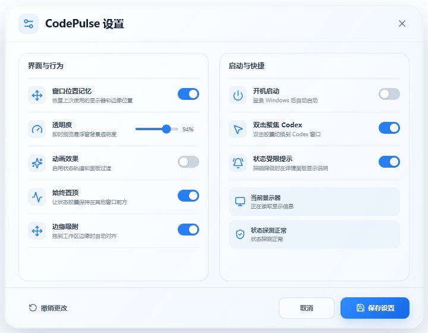
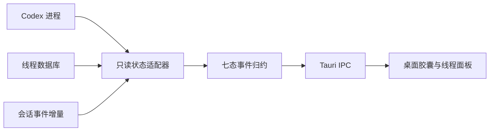

<div align="center">

# CodePulse

### 让 Codex 的工作状态，始终在桌面上一目了然

轻量、安静、常驻桌面的 Windows Codex 状态伴生应用。

[](https://github.com/EimJacky/CodePulse/releases/latest)
[](https://tauri.app/)
[](https://github.com/EimJacky/CodePulse/releases/latest)
[](https://github.com/EimJacky/CodePulse/stargazers)

<br>


<br>

[**下载 Windows 最新版**](https://github.com/EimJacky/CodePulse/releases/latest/download/CodePulse-Setup-Windows-x64.exe) · [查看更新记录](https://github.com/EimJacky/CodePulse/releases) · [反馈问题](https://github.com/EimJacky/CodePulse/issues)

</div>

## CodePulse 0.2.0

CodePulse 用一个克制的桌面胶囊持续呈现 Codex 的工作状态。单击即可展开活动线程，双击聚焦 Codex；无需反复切换窗口确认任务是否完成，或是否正在等待你的操作。

<table>
  <tr>
    <td align="center"><br><b>空闲</b><br><sub>安静等待下一项任务</sub></td>
    <td align="center"><br><b>完成</b><br><sub>绿色反馈保留 8 秒</sub></td>
    <td align="center"><br><b>需要关注</b><br><sub>失败反馈保留 15 秒</sub></td>
  </tr>
</table>

## 功能亮点

- **七态实时感知**：离线、空闲、思考、执行、等待确认、完成和失败。
- **活动线程面板**：查看最多 8 条线程的名称、状态、持续时间和最近变化。
- **多屏与 DPI 自适应**：兼容负坐标显示器及 100%–200% 缩放，并始终限制在任务栏工作区内。
- **独立设置窗口**：透明度即时预览；取消恢复、保存持久化。
- **完整桌面交互**：单击展开、双击聚焦、右键原生菜单、边缘吸附和位置记忆。
- **托盘常驻**：显示/隐藏、始终置顶、开机启动、设置和退出；隐藏后状态监听仍持续运行。
- **隐私优先**：仅在本机只读推导状态，不解析、保存或上传提示词与回复正文。

<details>
<summary><b>查看 0.2.0 设置窗口</b></summary>
<br>
<div align="center"></div>
</details>

## 安装

1. 前往 [Releases](https://github.com/EimJacky/CodePulse/releases/latest) 下载 `CodePulse-Setup-Windows-x64.exe`。
2. 双击安装并启动 CodePulse；首次出现于主显示器右上角。
3. 单击胶囊展开详情，双击聚焦 Codex，右键或托盘图标打开更多操作。

支持 Windows 10/11 与 Codex 桌面版。0.2.0 安装包包含所需的 `WebView2Loader.dll`，并支持从 0.1.2 原位升级。

> CodePulse 是社区伴生工具，与 OpenAI 无官方隶属关系。

## 状态与隐私



CodePulse 使用文件监听与事件增量读取，2 秒轮询仅作兜底。数据源缺失、锁定或格式变化时，会降级为进程级状态并显示“状态受限”，不会影响 Codex 自身运行。

聚合优先级：`失败 > 等待确认 > 执行 > 思考 > 完成 > 空闲 > 离线`。

## 本地开发

需要 Node.js 20+、Rust 1.80+、Windows WebView2 及 Tauri Windows 构建依赖。

```powershell
git clone https://github.com/EimJacky/CodePulse.git
cd CodePulse
npm install
npm test
npm run tauri dev
```

构建 Windows NSIS 安装包：

```powershell
npm run tauri build
```

前端位于 `src/`，Codex 状态适配器位于 `src-tauri/src/provider.rs`。

## 参与贡献

欢迎提交 [Issue](https://github.com/EimJacky/CodePulse/issues) 或 [Pull Request](https://github.com/EimJacky/CodePulse/pulls)。如果 CodePulse 对你有帮助，给它一个 **Star**，让更多 Codex 用户发现它。

<div align="center">

**[Star CodePulse](https://github.com/EimJacky/CodePulse)**

Made for people who build with Codex.

</div>